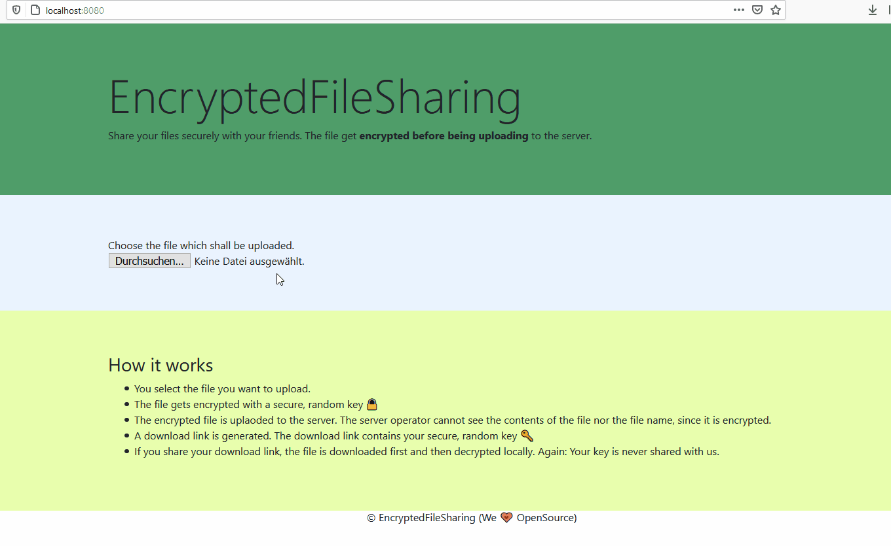

⚠️ This project is **deprecated**. It is not recommended to use it in production. ⚠️

---
# EncryptedFileSharing
EncryptedFileSharing is a minimal file sharing service which allows users to share files which are encrypted before being uploaded. As a result, even the server operator cannot see the unencrypted content. EncryptedFileSharing uses mainly **Go and Javascript**.



EncryptedFileSharing is...
* **secure 🔒** - in the background AES-256 is being used to encrypt files. **AES-256** is a **military-grade encryption** and is being used to encrypt the most sensible data in the US government. I am not saying that it is unbreakable - but I think it is very secure after all.
* **flat** - you **do not need a SQL-Server** in the background or an AWS-Account. In fact, you **don't even need to install a webserver**, since one is already shipped with EncryptedFileSharing itself (although we recommend it).
* **minimal** - there is no admin interface, automatic file deletion or even a file limitation. EncryptedFileSharing shall be **up and running within a very short amount of time**. The administration overhead should be minimal.
* **open for contributions ⛑** - there are **many things which can be improved** right now. There is no progressbar when uploading, encrypting or decrypting files, nor a very nice user experience. If you want to help -- feel free to contribute.
* **built on the shoulders of giants** - this project uses [Crypto-JS](https://github.com/brix/crypto-js), is hugely inspired by [send](https://github.com/mozilla/send) and [upload.vaa.red](https://upload.vaa.red/). Furtheremore, huge thanks to [topaco on stackoverflow](https://stackoverflow.com/a/60550134) and of course [Bootstrap](https://getbootstrap.com/).

## What are typical use cases?
* share private files with others without having to use any external tools for en- and decryption, e.g. credentials
* share files among devices without worrying that external parties can have a look into them, e.g. your payroll
* encrypt on the go. EncryptedFileSharing works on your mobile phones, too.

## How to get started?
### Most simple case - Go already installed
In the most simple case you already have go installed:

1. Clone this repository (`git clone https://github.com/hija/EncryptedFileSharing.git`)
2. Go into the backend directory and run efs-server.go (`cd EncryptedFileSharing/backend && go run efs-server.go`)
3. Head over to http://localhost:8080/ and try it out :) (I recommend using a small file, e.g. a text file, first)


### Full tutorial for Amazon AWS:
1. Create a new EC2 instance (t2.micro is fine) with Amazon Linux 2 and add you ip for all tcp incoming connections in the security group
2. Run the following commands on the server:
```
        sudo yum install golang git -y
        git clone https://github.com/hija/EncryptedFileSharing.git
        go get -u github.com/Terry-Mao/goconf
        cd EncryptedFileSharing/backend && go run efs-server.go
```
3. Go to http://[YOUR-AWS-IP]:8080/ and try it out :)

### Using nginx as frontend server
(TODO)
